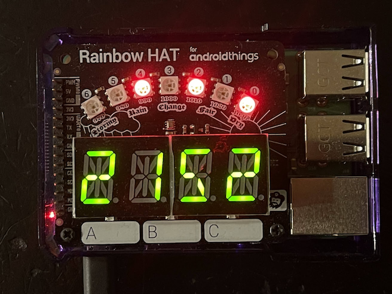

# Rainbow Clock

A clock app running on [Raspberry Pi 3](https://www.raspberrypi.com/products/raspberry-pi-3-model-b-plus/) 
with [Rainbow Hat](https://shop.pimoroni.com/products/rainbow-hat).

The current time is 21:52:21

* Touch A for Year.
* Touch B for date.
* Touch C for day of week.
* LED show seconds in binary. 